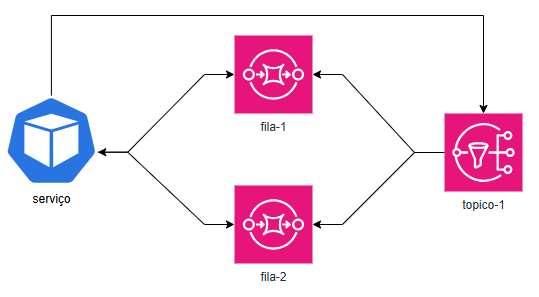
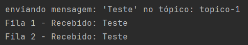

# Exemplos de conexões AWS usando o localstack

## Run

1. Rodar Docker localmente
2. Rodar o docker-compose.yml
3. Rodar a aplicação

Isso criará:
* um bucket no localstack com o nome "meu-bucket". [Bucket](https://app.localstack.cloud/inst/default/resources/s3)
* um tópico com o nome "topico-1". [SNS](https://app.localstack.cloud/inst/default/resources/sns)
* duas filas com os nomes "fila-1" e "fila-2". [SQS](https://app.localstack.cloud/inst/default/resources/sqs)
 
## S3 
<details>
<summary>Exemplos</summary>

### Upload

Exemplo de como subir um arquivo para o S3:

```bash
curl --location 'http://localhost:8080/localstack/s3/upload' \
--form 'file=@"/C:/Users/nome_arquivo"'
```


### Download

Exemplo de download de um arquivo pelo nome:

```bash
curl --location 'http://localhost:8080/localstack/s3/download/localstack_test.txt'
```

</details>

## SNS - SQS
<details>
<summary>Exemplos</summary>

### Estrutura:


### Envio para o 'topico-1':

```bash
curl --location 'http://localhost:8080/localstack/mensageria/enviar/topico-1' \
--header 'Content-Type: application/json' \
--data '{
    "Message": "Teste"
}'
```

Fluxo: Ao enviar a mensagem para o '**topico-1**' a mensagem é redirecionada aos subinscritos '**fila-1**' e '**fila-2**' que são consumidas pelos '**Listeners**' da aplicacao.
Logs da aplicação:


### Envio para direto o 'fila-1':
```bash
curl --location 'http://localhost:8080/localstack/mensageria/enviar/fila-1' \
--header 'Content-Type: application/json' \
--data '{
    "Message": "Fila-1"
}'
```
### Envio para direto o 'fila-2':
```bash
curl --location 'http://localhost:8080/localstack/mensageria/enviar/fila-2' \
--header 'Content-Type: application/json' \
--data '{
    "Message": "Fila-2"
}'
```

</details>

