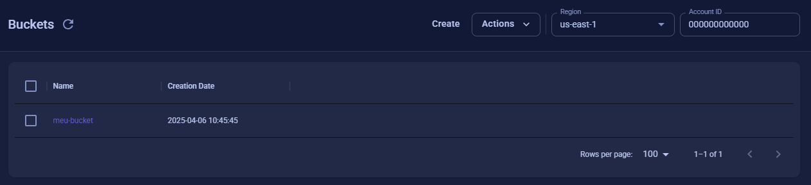
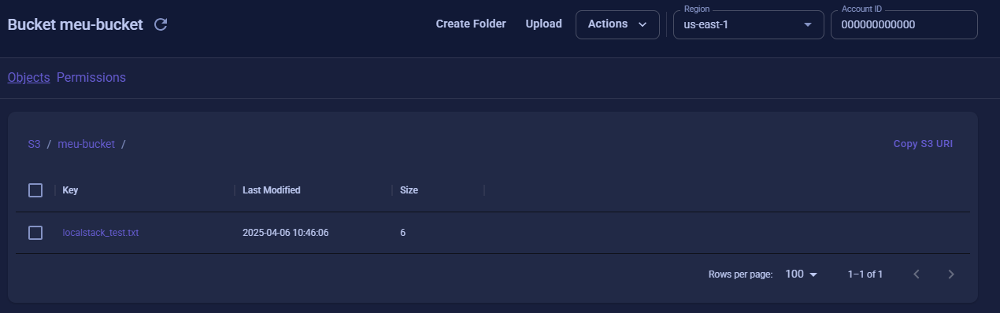

# Exemplos de conexões AWS usando o localstack

## 1 - S3
<details>
<summary></summary>

### Run

1. Rodar Docker localmente
2. Rodar o docker-compose.yml
3. Criar o bucket com o comando:
```bash
awslocal s3 mb s3://meu-bucket
```
Isso criará um bucket no localstack com o nome "meu-bucket". [Bucket Criado](https://app.localstack.cloud/inst/default/resources/s3)



### Upload

Exemplo de como subir um arquivo para o S3:

```bash
curl --location 'http://localhost:8080/localstack/s3/upload' \
--form 'file=@"/C:/Users/nome_arquivo"'
```



### Download

Exemplo de download de um arquivo pelo nome:

```bash
curl --location 'http://localhost:8080/localstack/s3/download/localstack_test.txt'
```

</details>

